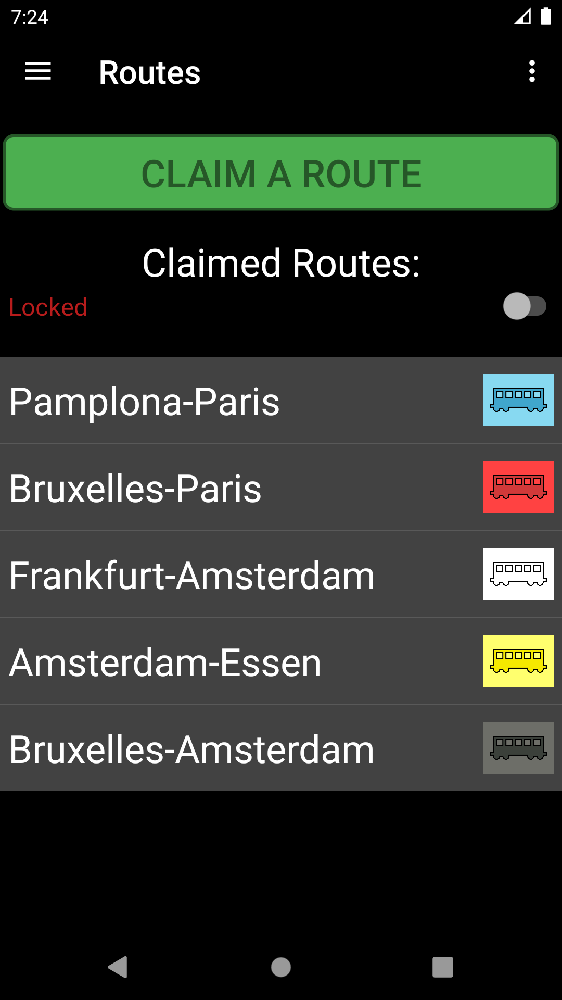
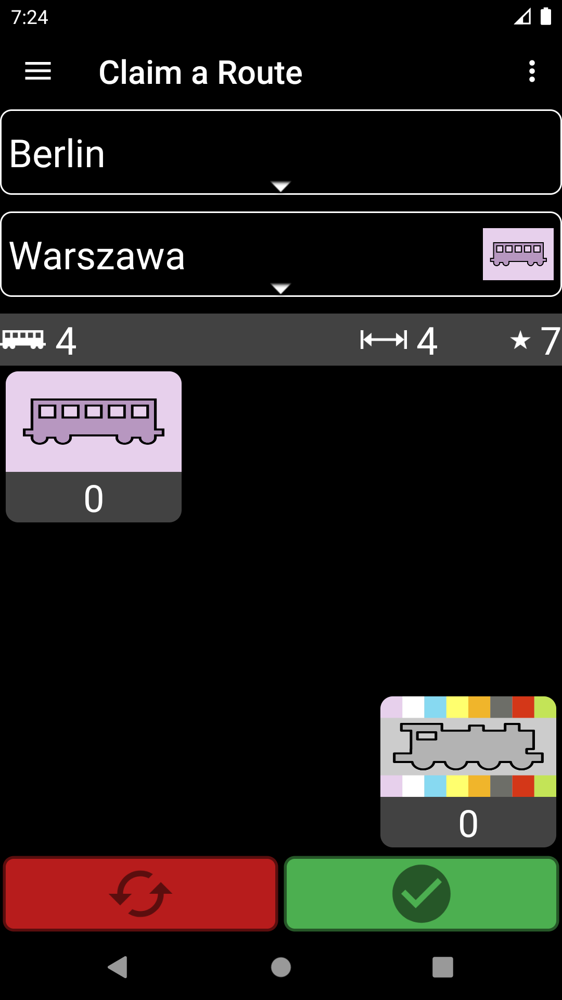
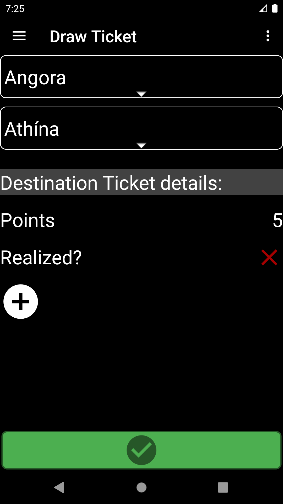
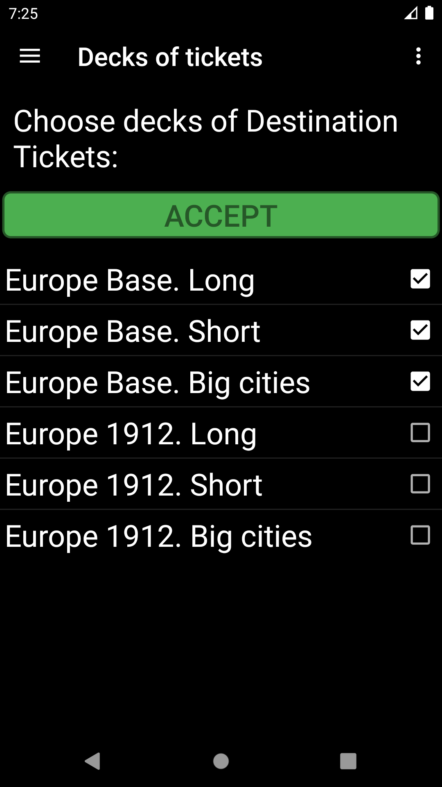

# Ticket to Ride Assistant
This application makes it easy to play the absolutely fantastic board game _Ticket to Ride_.
Manage your cards, routes and tickets in an intuitive way.
No more missed connections, scoring mistakes or tedious calculations of the longest route!

## System requirements
* Android 5.0+ (API level 21+)

## Technologies
* Java 8
* SQLite 3.24.0

## Currently available games
* USA
* Europe + 1912 Expansion Pack
* Nordic Countries

## Databases
Data on routes, tickets and scores for individual games can be found in the "_game_name_.db" databases in ./app/src/main/assets.
"General.db" contains the initial settings for games such as: number of cars, number of car cards etc.

## Player's guide
Choose your game after starting the application.
If you want, you can set the available destination tickets in _Ticket Decks_ option (especially when you want to use expansion packs).
Ticket to Ride Assistant offers several screens to support the game:

#### Status
Show player points, number of cars and train stations left, number of realized/unrealized tickets, length of the longest continuous path.
You can unlock the cards panel using the switch on the bottom, to manually modify the numbers of cards.
To add (remove) a card of an individual color, tap (long press) the corresponding tile.
#### Draw train car cards
You can draw new train car cards here. Add card by taping it or remove by long pressing.
Accept your choice by pressing green button or reset the cards set by pressing red button.
#### Routes
Show claimed routes. You can unlock the routes list and remove the route by long pressing it.
To claim a new one press the "Claim a route" button. First choose cities names. Then select proper train car cards.
Claim the route by pressing green button or reset the cards set by pressing red button.
#### Destination tickets
Show drawn destination tickets. You can unlock the ticket list and remove the ticket by long pressing it.
To draw a new ticket press "Draw a ticket" button. First choose cities names. Then draw a ticket by pressing the green button.
You can also define your own ticket (if not available in selected ticket decks). To do this, click the "+" button on the "Draw Ticket" screen.
#### Train Stations
(Only available only in some games) Show built train stations. You can unlock the station list and remove the station by long pressing it.
To build a new one press the "Build a new station" button. First choose cities names. Then select proper car cards.
Build the station by pressing green button or reset the cards set by pressing red button.
#### Warehouse
(Only available in some games) Pick train car cards from a warehouse.
Add card by taping it or remove by long pressing.
Accept your choice by pressing green button or reset the cards set by pressing red button.
#### Ticket Decks
Here you can choose decks of destination tickets.

## Status
Project is: _in progress_

## Snapshots
  
  
  